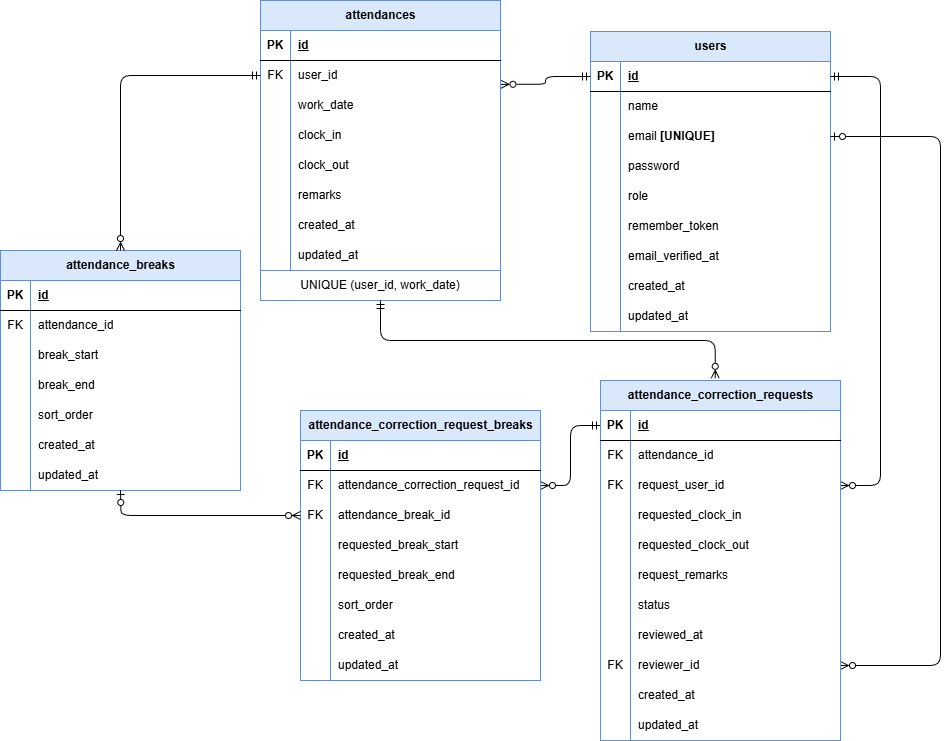

# テーブル仕様書

## テーブル仕様

### 1. usersテーブル
| カラム名          | 型              | PRIMARY KEY | UNIQUE KEY | NOT NULL | FOREIGN KEY |
| ----------------- | --------------- | ----------- | ---------- | -------- | ----------- |
| id                | unsigned bigint | ○           |            | ○        |             |
| name              | varchar(255)    |             |            | ○        |             |
| email             | varchar(255)    |             | ○          | ○        |             |
| password          | varchar(255)    |             |            | ○        |             |
| role              | varchar(20)     |             |            | ○        |             |
| remember_token    | varchar(100)    |             |            |          |             |
| email_verified_at | timestamp       |             |            |          |             |
| created_at        | timestamp       |             |            |          |             |
| updated_at        | timestamp       |             |            |          |             |

**※ roleは、`user`, `admin`のいずれかを取る**

### 2. attendancesテーブル
| カラム名   | 型              | PRIMARY KEY | UNIQUE KEY           | NOT NULL | FOREIGN KEY |
| ---------- | --------------- | ----------- | -------------------- | -------- | ----------- |
| id         | unsigned bigint | ○           |                      | ○        |             |
| user_id    | unsigned bigint |             | (user_id, work_date) | ○        | users(id)   |
| work_date  | date            |             | (user_id, work_date) | ○        |             |
| clock_in   | datetime        |             |                      |          |             |
| clock_out  | datetime        |             |                      |          |             |
| remarks    | varchar(255)    |             |                      |          |             |
| created_at | timestamp       |             |                      |          |             |
| updated_at | timestamp       |             |                      |          |             |

### 3. attendance_breaksテーブル
| カラム名      | 型               | PRIMARY KEY | UNIQUE KEY | NOT NULL | FOREIGN KEY     |
| ------------- | ---------------- | ----------- | ---------- | -------- | --------------- |
| id            | unsigned bigint  | ○           |            | ○        |                 |
| attendance_id | unsigned bigint  |             |            | ○        | attendances(id) |
| break_start   | datetime         |             |            | ○        |                 |
| break_end     | datetime         |             |            |          |                 |
| sort_order    | unsigned integer |             |            | ○        |                 |
| created_at    | timestamp        |             |            |          |                 |
| updated_at    | timestamp        |             |            |          |                 |

### 4. attendance_correction_requestsテーブル
| カラム名            | 型              | PRIMARY KEY | UNIQUE KEY | NOT NULL | FOREIGN KEY     |
| ------------------- | --------------- | ----------- | ---------- | -------- | --------------- |
| id                  | unsigned bigint | ○           |            | ○        |                 |
| attendance_id       | unsigned bigint |             |            | ○        | attendances(id) |
| request_user_id     | unsigned bigint |             |            | ○        | users(id)       |
| requested_clock_in  | datetime        |             |            | ○        |                 |
| requested_clock_out | datetime        |             |            | ○        |                 |
| request_remarks     | varchar(255)    |             |            | ○        |                 |
| status              | varchar(20)     |             |            | ○        |                 |
| reviewed_at         | timestamp       |             |            |          |                 |
| reviewer_id         | unsigned bigint |             |            |          | users(id)       |
| created_at          | timestamp       |             |            |          |                 |
| updated_at          | timestamp       |             |            |          |                 |

**※ statusは、`pending`, `approved`のいずれかを取る**

### 5. attendance_correction_request_breaksテーブル
| カラム名                         | 型               | PRIMARY KEY | UNIQUE KEY | NOT NULL | FOREIGN KEY                        |
| -------------------------------- | ---------------- | ----------- | ---------- | -------- | ---------------------------------- |
| id                               | unsigned bigint  | ○           |            | ○        |                                    |
| attendance_correction_request_id | unsigned bigint  |             |            | ○        | attendance_correction_requests(id) |
| attendance_break_id              | unsigned bigint  |             |            |          | attendance_breaks(id)              |
| requested_break_start            | datetime         |             |            | ○        |                                    |
| requested_break_end              | datetime         |             |            | ○        |                                    |
| sort_order                       | unsigned integer |             |            | ○        |                                    |
| created_at                       | timestamp        |             |            |          |                                    |
| updated_at                       | timestamp        |             |            |          |                                    |

## ER図
